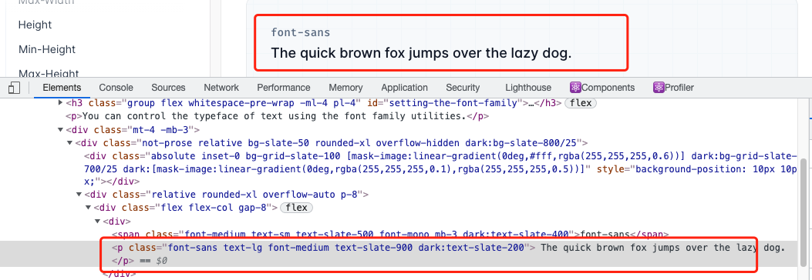

# flutter_tailwindcss

体验用 tailwind 的方式去写 flutter 样式

## 介绍

[中文](./README_ZH.md) | [English](./README.md)

### 如何使用

```
dependencies:
  flutter_vant_kit: ^0.0.3
```

## 进度

| doing      | name           | verison |
| ---------- | -------------- | ------- |
| 🚀 done    | `TwColor`      | `0.0.2` |
| 🚀 done    | `Spacing`      | `0.0.3` |
| 👷 doing   | `TwText`       | -       |
| 👷 doing   | `TwFont`       | -       |
| ⏳ planing | `BorderRadius` | -       |
| ⏳ planing | `BorderWidth`  | -       |
| ⏳ planing | `Divide`       | -       |
| ⏳ planing | `Shadow`       | -       |

## 实例

### colors


### spacing


### TwText

`TwText` 和 `TwFont` 结合使用，TwText 相当于 flutter 中的 Text 只不过多了一个`className`参数。

**看下和`tailwind`的差异**



```html
<p class="font-sans text-lg font-medium text-slate-900">
  The quick brown fox jumps over the lazy dog.
</p>
```

```dart
TwText(
    'The quick brown fox jumps over the lazy dog.', className: [
    /// 文字等宽
    TwFont().sans,
    /// 文字大小 + 行高
    TwFont().text.lg,
    /// 文字颜色
    TwFont().slate.shade900,
    /// 加粗
    TwFont().medium
])
```

> 因为 TwFont 是一个类，所以无需安装插件，也可做到智能提示

## 项目中的 demo


